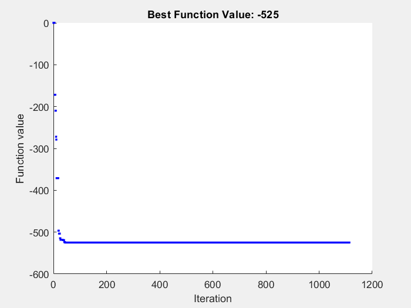

# Solving optimization problems 
  
# 1. Solving optimization problem using simulated Annealing

Simulated Annealing is a global optimization algorithm inspired by the annealing process in metallurgy where metals are heated to a high temperature and cooled slowly in a controlled manner.  Simulated annealing works in a similar way. The algorithm starts with a random solution to the problem. It then repeatedly generates new solutions, and accepts or rejects them based on a probability. The probability of accepting a worse solution decreases as the temperature decreases. The algorithm terminates when the temperature reaches a certain level, or when a certain number of iterations have been performed.

$$
f(x)=0.3x_1^3 -1.5x_2^2 +7.5x_1
$$
## **Function visualization**

```matlab:Code
clear;clc;
dim = 50;
x1 = linspace( -10, 10, dim); 
x2 = linspace(-10, 10, dim);
[X,Y] = meshgrid(x1,x2);

ff = @(x1, x2) 0.3*x1.^3 - 1.5*x2.^2 + 7.5*x1 ; 
figure;
surf(X,Y,ff(X,Y))
xlabel('x(1)')
ylabel('x(2)')
zlabel('f')
grid on;
```


## Performing optimization

```matlab:Code
% optimizing the booth's function using simulated annealing 
ff = @(x) 0.3*x(1).^3 - 1.5*x(2).^2 + 7.5*x(1) ;
x0 = [0 0]; % initial parameters
Lb = -10*ones(1,2); % lower bound
Ub =  10*ones(1,2); % upper bound
opt = optimoptions(@simulannealbnd,...
    'Display', 'iter',... % Level of display
    'reannealinterval', 100,... % Reannealing interval
    'plotfcn', @saplotbestf);
[xf,fval,exitflag] = simulannealbnd(ff,x0,Lb,Ub,opt);
```

```text:Output
                           Best        Current           Mean
Iteration   f-count         f(x)         f(x)         temperature
     0          1              0              0            100
    10         11       -272.071       -272.071          56.88
    20         21       -496.487       -496.487        34.0562
    30         31       -518.223       -518.223        20.3907
    40         41       -519.204        -514.25        12.2087
    50         51       -524.964       -520.944        7.30977
    60         61       -524.964       -522.843        4.37663
    70         71       -524.964       -524.788        2.62045
    80         81       -524.964        -524.31        1.56896
    90         91       -524.999       -524.999       0.939395
   100        101           -525           -525        0.56245
   110        111           -525           -525        0.33676
   120        121           -525           -525       0.201631
   130        131           -525           -525       0.120724
   140        141           -525           -525      0.0722817
   150        151           -525           -525      0.0432777
   160        161           -525       -524.995       0.025912
   170        171           -525       -524.995      0.0155145
   180        181           -525       -524.999     0.00928908
   190        191           -525           -525     0.00556171

```



```text:Output
Optimization terminated: change in best function value less than options.FunctionTolerance.
```

## Plot after optimization

```matlab:Code
dim = 50;
x1 = linspace( -10, 10, dim); 
x2 = linspace(-10, 10, dim);
[X,Y] = meshgrid(x1,x2);

ff = @(x1, x2) 0.3*x1.^3 - 1.5*x2.^2 + 7.5*x1 ; 
figure;
surf(X,Y,ff(X,Y))
hold on;
xlabel('x(1)')
ylabel('x(2)')
zlabel('f')
grid on;
plot3(xf(1),xf(2),fval, 'r^');
hold off;
```


## **Results after optimization**

```matlab:Code
display(xf)
```

```text:Output
xf = 1x2    
   -10   -10

```

# 2. Solving optimization problem using genetic algorithm

A genetic algorithm (GA) is a search heuristic that is routinely used to generate useful solutions to optimization and search problems. Genetic algorithms are inspired by the process of natural selection that governs the evolution of biological populations.

A GA works by creating a population of possible solutions to a problem, and then iteratively modifying that population to improve the quality of the solutions. The GA uses a process of selection, crossover, and mutation to create new solutions from the existing population.

$$
f(x)=10.2x_1^4 -3.8x_2^2 +7.1x_1
$$
## **Function visualization**

```matlab:Code
clear;clc;
dim = 50;
x1 = linspace( -10, 10, dim); 
x2 = linspace(-10, 10, dim);
[X,Y] = meshgrid(x1,x2);

ff = @(x1, x2) 10.2*x1.^4 - 3.8*x2.^2 + 7.1*x1 ; 
figure;
surf(X,Y,ff(X,Y))
xlabel('x(1)')
ylabel('x(2)')
zlabel('f')
grid on;
```


## Performing optimization with pattern search

```matlab:Code
lb = -10*ones(1,2); % lower bound
ub =  10*ones(1,2); % upper bound
A = [];
b = [];
Aeq = [];
beq = [];
ff = @(x) 10.2*x(1).^4 - 3.8*x(2).^2 + 7.1*x(1) ;
% initial parameters
x0 = [1,-5];
x = patternsearch(ff,x0,A,b,Aeq,beq,lb,ub)
```

```text:Output
Optimization terminated: mesh size less than options.MeshTolerance.
x = 1x2    
   -0.5583  -10.0000

```

## **Results after optimization**

```matlab:Code
display(x)
```

```text:Output
x = 1x2    
   -0.5583  -10.0000

```

## **Plot after optimization **

```matlab:Code
dim = 50;
x1 = linspace( -10, 10, dim); 
x2 = linspace(-10, 10, dim);
[X,Y] = meshgrid(x1,x2);
ff = @(x1, x2) 10.2*x1.^4 - 3.8*x2.^2 + 7.1*x1 ; 
figure;
surf(X,Y,ff(X,Y))
hold on;
xlabel('x(1)')
ylabel('x(2)')
zlabel('f')
grid on;
plot3(x(1),x(2),ff(x(1),x(2)), 'r^');
hold off;
```


# 3. Solving optimization problem using Particle swarm

Particle swarm is a population-based optimization algorithm that is inspired by the social behavior of birds or fish. It is a simple and efficient algorithm that can be used to solve a variety of optimization problems.

This algorithm works by having a population of particles (candidate solutions) that move around in a search space. At each step, each particle is attracted to its own best-known position (pbest) and to the global best position (gbest) that has been found so far by any particle in the swarm. The particles move towards these best positions by updating their velocities.

$$
f(x)=(x_1 -7.9)(x_2 +8.8)^3
$$
## **Function visualization**

```matlab:Code
clear;clc;
dim = 50;
x1 = linspace( -10, 10, dim); 
x2 = linspace(-10, 10, dim);
[X,Y] = meshgrid(x1,x2);

ff = @(x1, x2) (x1  - 7.9).*(x2 + 8.8).^3; 
figure;
surf(X,Y,ff(X,Y))
xlabel('x(1)')
ylabel('x(2)')
zlabel('f')
grid on;
```


## Performing optimization with particle swarm

```matlab:Code
lb = -10*ones(1,2); % lower bound
ub =  10*ones(1,2); % upper bound
ff = @(x) (x(1) - 7.9).*(x(2) + 8.8).^3;
options = optimoptions('particleswarm','SwarmSize',50,'HybridFcn',@fmincon);
rng default  % For reproducibility
nvars = 2;
[x,fval,exitflag,output] = particleswarm(ff,nvars,lb,ub,options)
```

```text:Output
Optimization ended: relative change in the objective value 
over the last OPTIONS.MaxStallIterations iterations is less than OPTIONS.FunctionTolerance.
x = 1x2    
   -10    10

fval = -1.1894e+05
exitflag = 1
output = 
      rngstate: [1x1 struct]
    iterations: 21
     funccount: 1115
       message: 'Optimization ended: relative change in the objective value ↵over the last OPTIONS.MaxStallIterations iterations is less than OPTIONS.FunctionTolerance.↵FMINCON: Local minimum found that satisfies the constraints.↵↵Optimization completed because the objective function is non-decreasing in ↵feasible directions, to within the value of the optimality tolerance,↵and constraints are satisfied to within the value of the constraint tolerance.↵↵<stopping criteria details>↵↵Optimization completed: The relative first-order optimality measure, 7.333395e-08,↵is less than options.OptimalityTolerance = 1.000000e-06, and the relative maximum constraint↵violation, 0.000000e+00, is less than options.ConstraintTolerance = 1.000000e-06.↵'
    hybridflag: 1

```

## **Results after optimization**

```matlab:Code
display(x)
```

```text:Output
x = 1x2    
   -10    10

```

## **Plot after optimization **

```matlab:Code
dim = 50;
x1 = linspace( -10, 10, dim); 
x2 = linspace(-10, 10, dim);
[X,Y] = meshgrid(x1,x2);
ff = @(x1, x2) (x1  - 7.9).*(x2 + 8.8).^3; 
figure;
surf(X,Y,ff(X,Y))
hold on;
xlabel('x(1)')
ylabel('x(2)')
zlabel('f')
grid on;
plot3(x(1),x(2),fval, 'r^');
hold off;
```


# 4. Solving optimization problem using surrogate optimization

The surrogate model is then used to guide the search for an optimal solution, without the need to evaluate the expensive objective function at every iteration.

Surrogate optimization is often used in cases where the objective function is expensive to evaluate, such as when it requires a simulation or a physical experiment. In these cases, surrogate optimization can be used to reduce the number of expensive evaluations required to find an optimal solution.

$$
f(x)=(x_1 -5.8)^2 (x_2 -4.1)^2
$$
## **Function visualization**

```matlab:Code
clear;clc;
dim = 50;
x1 = linspace( -10, 10, dim); 
x2 = linspace(-10, 10, dim);
[X,Y] = meshgrid(x1,x2);

ff = @(x1, x2) (x1  - 5.8).^2.*(x2 - 4.1).^2; 
figure;
surf(X,Y,ff(X,Y))
xlabel('x(1)')
ylabel('x(2)')
zlabel('f')
grid on;
```


## Performing optimization with surrogate optimization

```matlab:Code
rng default  % For reproducibility
lb = -10*ones(1,2); % lower bound
ub =  10*ones(1,2); % upper bound
ff = @(x) (x(1)  - 5.8).^2.*(x(2) - 4.1).^2; 
x = surrogateopt(ff,lb,ub)
```


```text:Output
Warning: Some output might be missing due to a network interruption. To get the missing output, rerun the script.
```

## **Plot after optimization **

```matlab:Code
dim = 50;
x1 = linspace( -10, 10, dim); 
x2 = linspace(-10, 10, dim);
[X,Y] = meshgrid(x1,x2);
ff = @(x1, x2) (x1  - 5.8).^2.*(x2 - 4.1).^2; 
figure;
surf(X,Y,ff(X,Y))
hold on;
xlabel('x(1)')
ylabel('x(2)')
zlabel('f')
grid on;
plot3(x(1),x(2),ff(x(1),x(2)), 'r^');
hold off;
```


# 5. Solving optimization problem using Global search 

Global search algorithm works by exploring the search space in a random or systematic way. They may use a variety of techniques to guide the search, such as local search, hill climbing. The goal of global search is to find the global optimum, which is the point in the search space where the objective function has its lowest value.

$$
f(x)=0.5x_1^4 -9.4x_2^2 +2.5
$$
## **Function visualization**

```matlab:Code
dim = 50;
x1 = linspace( -10, 10, dim); 
x2 = linspace(-10, 10, dim);
[X,Y] = meshgrid(x1,x2);

ff = @(x1, x2) 0.5*x1.^4 - 9.4*x2.^2 + 2.5; 
figure;
surf(X,Y,ff(X,Y))
xlabel('x(1)')
ylabel('x(2)')
zlabel('f')
grid on;
```


  
## Optimization of function

```matlab:Code
rng default % For reproducibility
gs = GlobalSearch;
lb = -10*ones(1,2); % lower bound
ub =  10*ones(1,2); % upper bound
x0 = [0, 0];
ff = @(x) 0.5*x(1).^4 - 9.4*x(2).^2 + 2.5 ; 
problem = createOptimProblem('fmincon','x0',x0,...
    'objective',ff,'lb',lb,'ub',ub);
[x, fval] = run(gs,problem);
```

```text:Output
GlobalSearch stopped because it analyzed all the trial points.

All 10 local solver runs converged with a positive local solver exit flag.
```

## Results after optimization

```matlab:Code
display(x)
```

```text:Output
x = 1x2    
   -0.0359   10.0000

```

## **Plot after optimization **

```matlab:Code
dim = 50;
x1 = linspace( -10, 10, dim); 
x2 = linspace(-10, 10, dim);
[X,Y] = meshgrid(x1,x2);
ff = @(x1, x2) 0.5*x1.^4 - 9.4*x2.^2 + 2.5; 
figure;
surf(X,Y,ff(X,Y))
hold on;
xlabel('x(1)')
ylabel('x(2)')
zlabel('f')
grid on;
plot3(x(1),x(2),fval, 'r^');
hold off;
```


